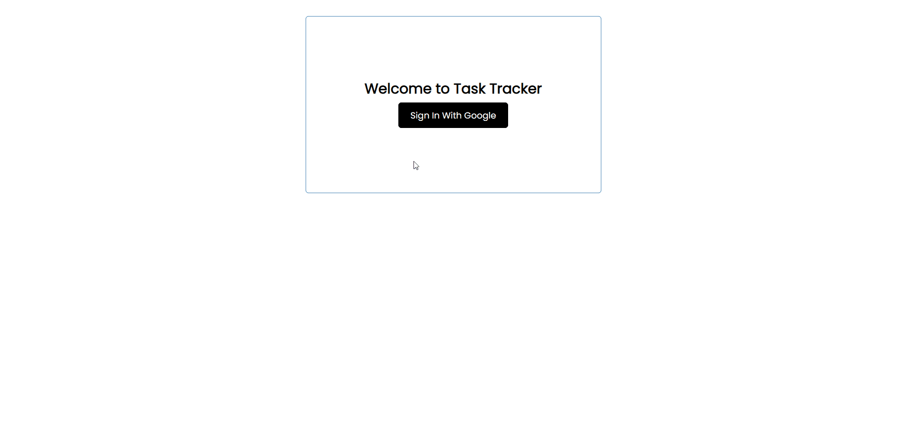

# Task Tracker
A React application that is used to track tasks. <del>[Json server](https://github.com/typicode/json-server) is used as the mock server.</del> Firebase is used for the authentication and database.
> This project is a simple project to understand how React's hooks work



## How to run 

<del> ### Starting the mock server </del> **No longer relevant**
- Run `npm run server` in your terminal to start the server
- You can change the server port number in package.json file after "--port YOUR_PORT_NUMBER"
> Change firebase reference to json server if you wish to use mock database

### Setup the database and Google login

- Create a firebase project
- Create a `.env` file in the project folder
- Fill up the below with firebase project's config
```
  REACT_APP_APIKEY = 
  REACT_APP_AUTHDOMAIN = 
  REACT_APP_PROJECTID = 
  REACT_APP_STORAGEBUCKET = 
  REACT_APP_MESSAGINGSENDERID = 
  REACT_APP_APPID = 
  REACT_APP_MEASUREMENTID = 
```
- Go to authentication in the firebase project and enable Google login as the sign-in method

### Starting the react application
- Run `npm run start` in your terminal to start the React app