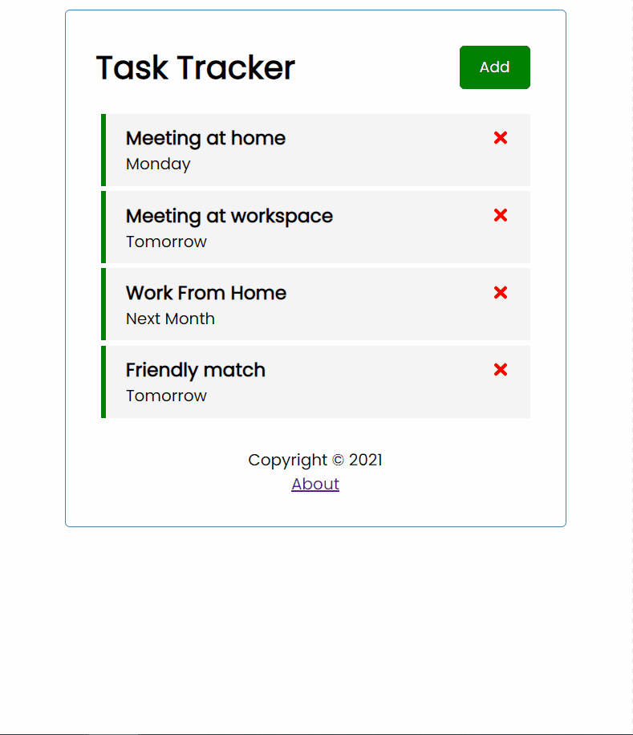

# Task Tracker
A React application that is used to track tasks. [Json server](https://github.com/typicode/json-server) is used as the mock server.
> This project is a simple project to understand how React's hooks work

## How to run 
### Starting the mock server
- Run `npm run server` in your terminal to start the server
- You can change the server port number in package.json file after "--port YOUR_PORT_NUMBER"

### Starting the react application
- Run `npm run start` in your terminal to start the React app